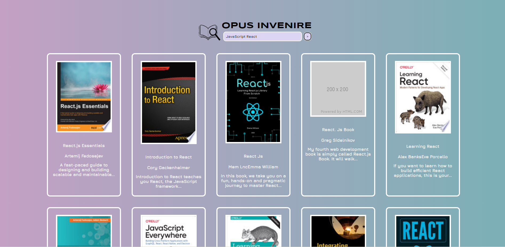

## Project: Google Books API Search Engine (Opus-Invenire)

### Overview

This project requires the use of both DOM manipulation and Asynchronous programming to build a Google Books search engine. The aim of the project is to allow the user to search for a book inside the Google Books database to find the desired publication.

### Goals

-   Create a search engine that accurately returns matches for a user's search.

### Criteria

Must include the following:

-   Header section introducing the page
-   Form containing a text input and a submit/search button
-   Grid of books

Instructions
-   On click of the submit button, request books from the Google Books API using the input value as your query string
-   Books received should be rendered in books grid
-   Each book should have:
    -   an image
    -   author
    -   title and,
    -   description
-   Grid should be responsive on different screen sizes
-   Use async/await

Styling:

-   Must use BEM.
-   Use modules so each block has its own SCSS.
-   Palette module should also use variables.

Application Design:

-   Separate DOM functions and non-DOM functions in different modules
-   Write as many non-DOM functions as you can
-   Functions should be pure and as reusable as possible
-   Always use iterators over loops
-   Always parametize and abstract large pieces of duplicate code

BONUS:

-   Give feedback when no book results can be found for the query
-   When the user clicks a book in the grid, a pop-up should appear with more information about the book:
    -   release date
    -   publish date
    -   country
    -   languages
    -   publisher
    -   version/edition (if applicable)
    -   volume count (if applicable)

## The to-do list

Even though the criteria is already quite extensive for this project, this section will cover some notes regarding the project.

## The APP

